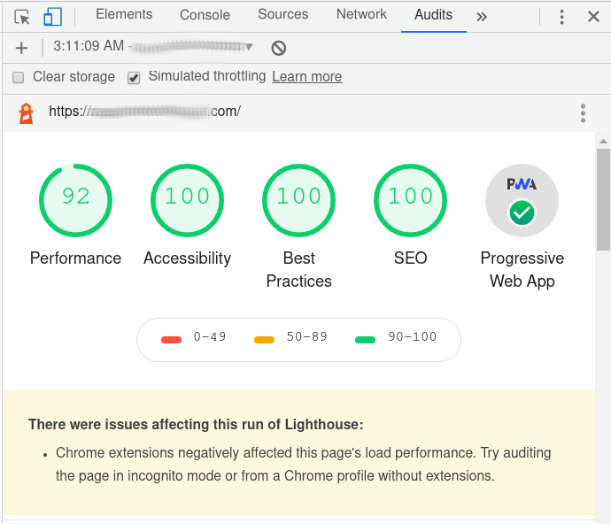

# PWA using NextJS and deployed on App Engine

  

## Introduction

This repository is a bare bones [PWA](https://developer.mozilla.org/en-US/docs/Web/Progressive_web_apps) using [NexJS](https://github.com/zeit/next.js). It is a flexible setup which can be used as a boilerplate for a more complex app.

## Setup

I am currently running this with node version *v10*, but I am no sure with which versions of node this is compatible

The setup should be pretty straightforward:

### Clone this repo

`git clone https://github.com/italomg/nextjs_pwa.git`

### Install the dependencies

`npm install`

## Running

### Run tests

`npm run test`

P.S.: As this isn't supposed to have any functionalities there aren't any tests as well.

### Run development

`npm run dev`

## Deploy

This app can be deployed to [Google App Engine](https://cloud.google.com/appengine). The only  you need to do is to add an *APP_ID* to *app.yaml*.
After setting up the [Google Cloud SDK CLI](https://cloud.google.com/sdk/docs) a new version of the app can be deployed by running:
`gcloud app deploy`

### Deploy benefits

Google app engine provide two major features which enables our app to become a PWA:

**HTTP/2**: By default all App Engine instances will use HTTP/2

**HTTPS**: With very little configuration it is possible to enforce HTTPS on all requests
